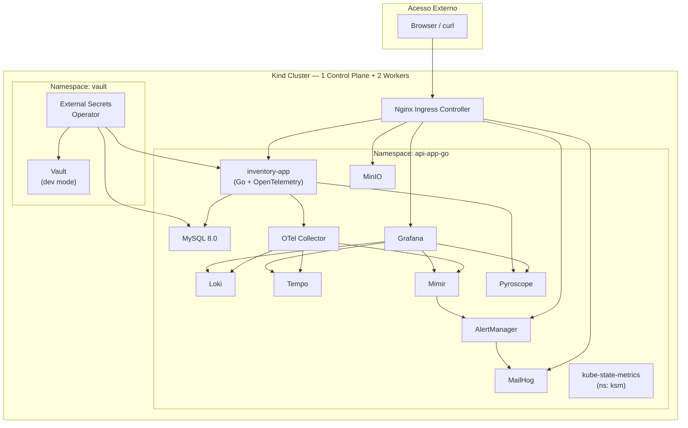
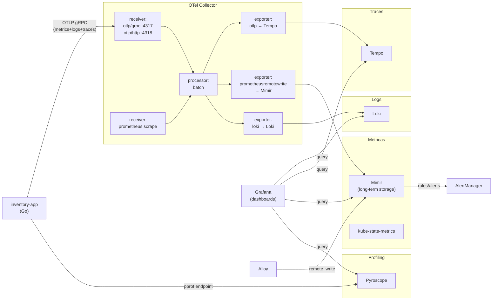
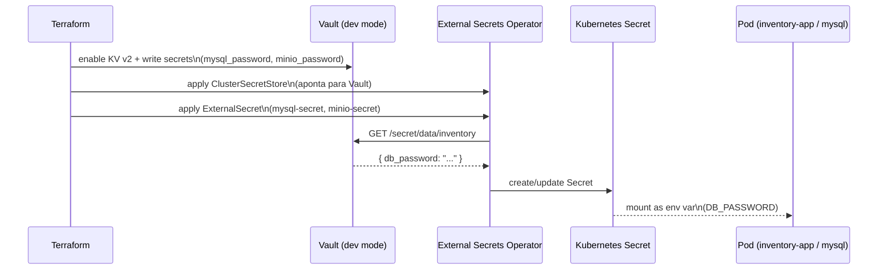
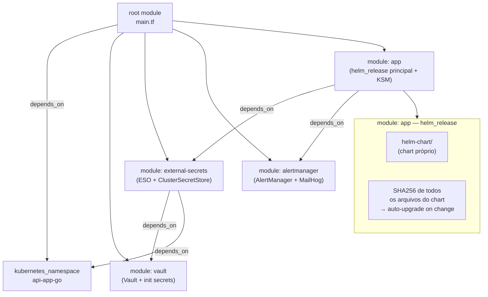
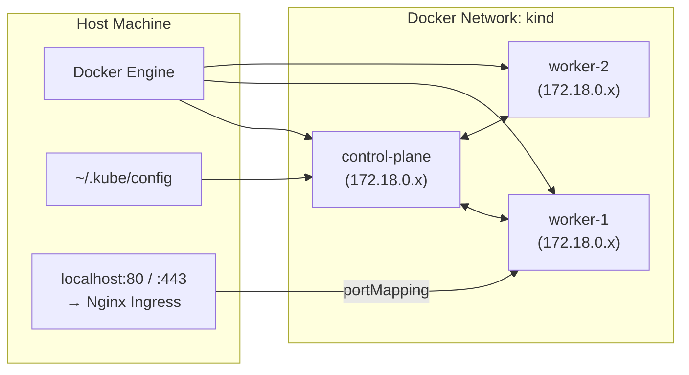

# Architecture Diagrams

## 1. Visão Geral dos Componentes

---

## 2. Fluxo de Observabilidade

---

## 3. Fluxo de Secrets (Vault → Pod)

---

## 4. Estrutura Terraform — Módulos

---

## 5. Infraestrutura Kind — Nodes e Networking

